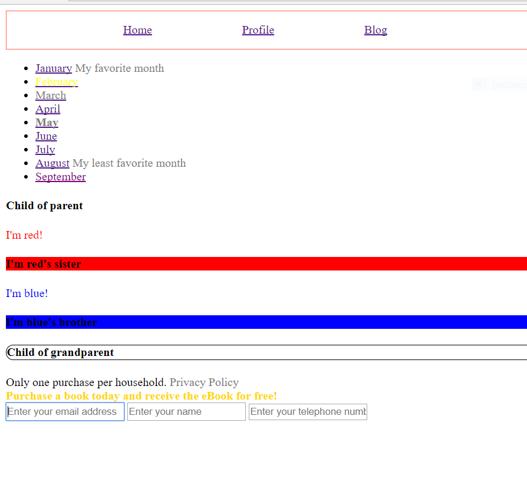

# CSS Selectors and Relationships

### Requirements

Paste the code below into your HTML document.

1. The header element should have a 1px border. Color, you pick.
1. Convert the `ul` in the navigation element into a series of horizontal links with # as the href value, without bullets, and have some space between them horizontally.
1. Ensure that the navigation is semantically marked as such (i.e. wrap it in the correct HTML tag).
1. Any text in an element with class "disabled" should be colored grey, unless it is inside an anchor tag. If inside an anchor, it should be colored purple.
1. Any text inside an element with a class of "active" should be colored yellow.
1. Section elements should be contained within an article element.
1. There are two missing closing tags in this document. Make sure you add them back in.
1. Make the `"I'm red"` text colored red.
1. Make the `"I'm blue"` text colored blue.
1. The sibling `h4` of the red element should have a background color of red.
1. The sibling `h4` of the blue element should have background color of blue.
1. Any `h4` that is a direct child of grandparent should have a 1px border with rounded corners.
1. Elements with a class of `promo` should have bold text that is also colored gold.
1. Without adding any other attributes to the `input` fields in the footer, write a CSS selector that makes any text input field have a height of `25px`.


```html
<header>
  <ul>
    <li>Home</li>
    <li>Profile</li>
    <li>Blog</li>
  </ul>
</header>

<section>
  <div class="month-list">
    <ul>
      <li>
        <a href="#">January</a>
        <span class="disabled">My favorite month</span>
      </li>
      <li>
        <a href="#">
          <span class="active">February</span>
        </a>
      </li>
      <li>
        <a href="#">
          <span class="disabled">March</span>
        </a>
      </li>
      <li>
        <a href="#">April</a>
      </li>
      <li>
        <a href="#">
          <div class="promo">
            <span class="disabled">May</span>
          </div>
        </a>
      </li>
      <li>
        <a href="#">June</a>
      </li>
      <li>
        <a href="#">July</a>
      </li>
      <li>
        <a href="#">August</a>
        <span class="disabled">My least favorite month</span>
      </li>
      <li>
        <a href="#" class="disabled">September</a>
      </li>
    </ul>
  </div>
</section>

<section>
  <div class="grandparent">
    <div class="parent">
      <h4>Child of parent</h4>
      <div>
        <div>I'm red!</div>
        <h4>I'm red's sister
        <div>I'm blue!</div>
        <h4>I'm blue's brother</h4>
      </div>
    </div>
    <h4>Child of grandparent</h4>
  </div>
</section>

<footer class="padded">

  <div class="disclaimer">
    Only one purchase per household.
    <a href="#">
      <span class="footer-link">
        <span class="disabled">
          Privacy Policy
        </span>
      </span>
  </div>

  <div class="promo">
    Purchase a book today and receive the eBook for free!
  </div>

  <span>
      <input type="text" name="email" placeholder="Enter your email address">
      <input type="text" name="name" placeholder="Enter your name">
      <input type="tel" name="telephone" placeholder="Enter your telephone number">
  </span>

</footer>
```

### Screen Shot of Project



### How do I run this project locally?

In order to run this project on your computer, please complete the following steps:
  1. Clone the project by clicking on the green "Clone or Download" button above.
  1. Run your terminal, type in git clone, then paste the information that was copied from github.
  1. Inside the project folder, type in http-server -c-1.
  1. Launch your internet browser and navigate to http://localhost:8080.